# Procura — Flowcharts Document

**Document status:** first developed English version  
**Language:** English  
**Related materials:** Procura one-pager; Target Group and Problem Validation Document; User Roles and Use Case Document; MVP Scope Document; GitHub repository documentation and implementation plan  
**Project:** Procura — AI-assisted B2B RFQ and supplier network  
**First market:** Hungary  
**Initial focus:** General, non-strategic procurement needs of Hungarian SMEs with 10–100 employees  
**Recommended use:** MVP scope refinement, development tickets, UX planning, backend process modeling, admin operations, validation pilot

---

## 1. Purpose of This Document

This document describes the main business and product workflows of the first version of Procura at flowchart level.

The goal is not to define every screen or technical detail permanently, but to give the team, development work and later documentation a shared view of:

- how a buyer RFQ starts;
- how a short need becomes a structured RFQ;
- how suppliers enter the process;
- how an invited or registered supplier responds;
- how the clarification Q&A process works;
- how offers arrive and can be compared;
- how a decision is made;
- where the audit trail appears;
- where an admin may intervene;
- how supply gaps and category expansion requests can be handled.

The document builds on the previously defined core logic:

> short buyer need → clarification → structured RFQ → supplier shortlist → invitation / open opportunity → questions and answers → offer submission → comparison → decision → audit trail → feedback.

---

## 2. Diagram Notation and Interpretation

The document uses Mermaid-compatible flowcharts. These can be rendered visually in GitHub, Notion, Obsidian, Mermaid Live Editor or several Markdown renderers.

General interpretation:

- **Buyer**: buyer-side user or company.
- **Supplier**: registered supplier.
- **Invited Supplier**: invited supplier, potentially without registration.
- **System**: the Procura system, including rule-based and AI-based logic.
- **Admin**: internal Procura platform admin / operator.
- **RFQ**: request for quotation.
- **Audit trail**: searchable business event log.

The flowcharts do not always represent the final implementation sequence. They describe product and business logic.

---

## 3. High-Level Procura Value Creation Loop

This is Procura’s central business workflow. Every other sub-process connects to it.

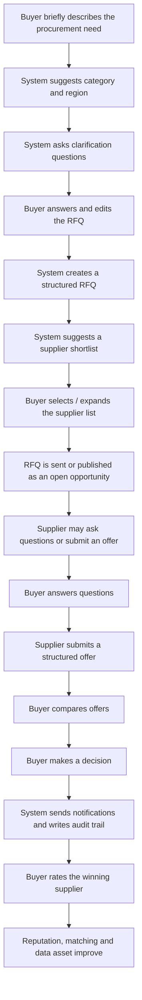

### Business Meaning

The goal of the first version of Procura is not to cover every procurement category or full ERP functionality. The goal is to make this loop fast, understandable, repeatable and measurable from a business perspective.

### Mandatory Parts from an MVP Perspective

- short intake;
- category/region detection or manual selection;
- clarification questions;
- structured RFQ;
- supplier shortlist;
- invitation;
- token-based supplier response;
- offer submission;
- offer list / comparison;
- decision;
- audit trail.

---

## 4. Buyer RFQ Creation Workflow

This is the most important first experience on the buyer side. The goal is to reach the state “I have an RFQ ready to send” within a few minutes.

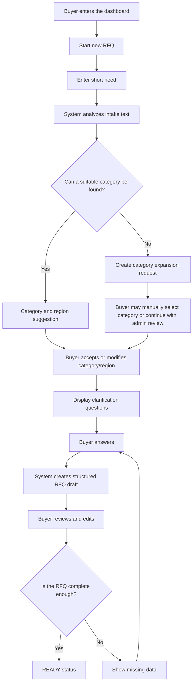

### Important UX Principle

The buyer should not feel that they are filling in a long administrative form. The first experience should feel like:

> “I briefly describe what I need, and the system helps me turn it into a good RFQ.”

### Edge Cases to Handle

- too short or unclear need;
- need that fits multiple categories;
- missing region;
- non-existing category;
- AI service unavailable;
- buyer abandons the process;
- buyer modifies the system suggestion.

---

## 5. Category and Region Handling Workflow

Category and region are the basis of matching. If they are wrong, the shortlist will also be wrong. Therefore, the buyer must always be able to override the system’s suggestion.

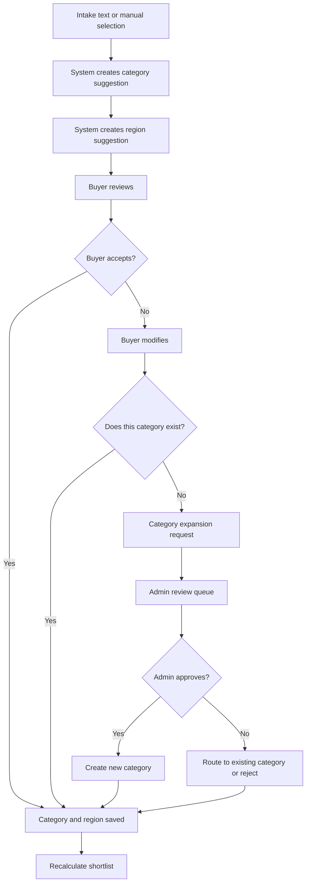

### Product Decision

A category expansion request should not become a dead end. The buyer should be able to continue creating the RFQ, while the system notifies admin that a new or poorly covered category appeared.

### Admin Perspective

Admin should see:

- which categories receive many expansion requests;
- where there are not enough suppliers;
- which categories generate many miscategorized RFQs;
- which new categories are worth adding officially.

---

## 6. Supplier Shortlist and RFQ Sending Workflow

The purpose of the shortlist is not to decide in a black-box manner who should be selected, but to provide an understandable and editable recommendation.

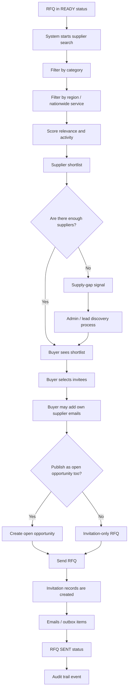

### Shortlist Criteria

Useful MVP shortlist criteria:

- category match;
- region match;
- nationwide service;
- supplier profile completeness;
- previous response rate;
- qualifications / certifications;
- ratings, if available;
- manual admin priority, if needed.

### Important Product Principle

The buyer can add their own suppliers as well. This reduces the cold-start problem and allows Procura to rely not only on its own supplier database.

---

## 7. Invited Supplier Token-Based Response Workflow

This is one of the most important cold-start-reducing workflows. A supplier must not get stuck at registration if they only want to respond to one specific RFQ.

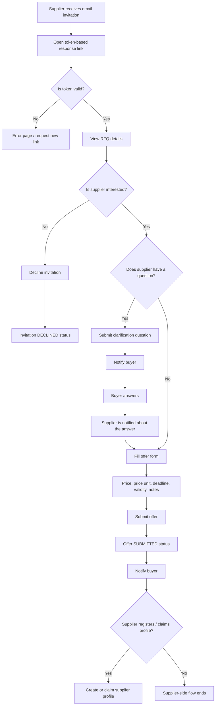

### MVP Minimum

- token is linked to one specific RFQ;
- token expiry and security rules;
- supplier can see the core RFQ details;
- supplier can ask a question;
- supplier can submit an offer;
- buyer is notified about the offer;
- supplier can register afterwards.

### Security Limitation

An invited, non-registered supplier should not see other RFQs, other buyer data or confidential platform-level information. However, aggregated marketing-style signals may be shown, for example: “there are currently X open opportunities in this category”, without details.

---

## 8. Registered Supplier Onboarding and Profile Workflow

The purpose of supplier onboarding is to let the supplier quickly define which categories and regions they cover. The first entry should not be too long.

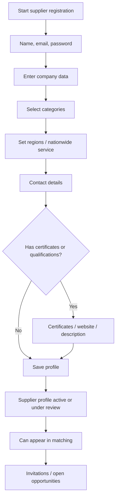

### Later Profile Claim Workflow

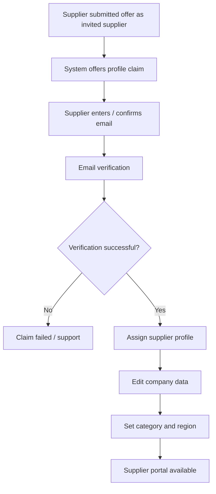

### Product Decision

The supplier side should keep two entry paths:

1. **Cold / self-registration** — supplier joins voluntarily.
2. **RFQ-based entry** — supplier first responds to a concrete RFQ, then claims their profile afterwards.

The second path is likely stronger for early marketplace validation.

---

## 9. Open Opportunity / Open Tender Workflow

The purpose of open opportunities is to ensure that the supplier side does not depend only on invitations. This strengthens the marketplace nature of the product, but only works well if there is enough supplier activity.

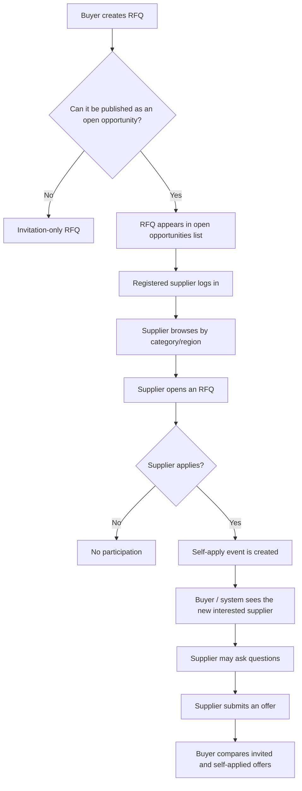

### MVP Question

The open opportunity feature is launch-relevant if the goal is not only buyer-tool validation, but also marketplace validation. Since the current direction is a two-sided Procura network, it is worth keeping this in the MVP, but it does not need to be overcomplicated.

### Minimum Rules

- only registered suppliers should be able to apply to open RFQs;
- suppliers should see only relevant / filterable RFQs;
- the buyer should see if a supplier arrived through the self-apply path;
- offers must remain confidential;
- admin should be able to moderate open RFQs.

---

## 10. Clarification Q&A Workflow

The purpose of Q&A is to improve offer comparability. If a supplier asks an important question, the answer should preferably be visible to all participating suppliers so that there is no information asymmetry.

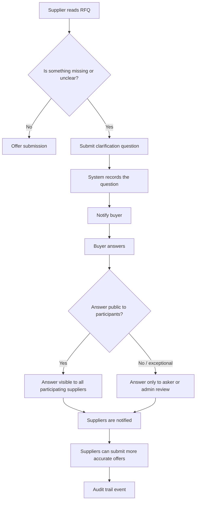

### Important Product Principle

Q&A is not primarily a private sales chat. It is an RFQ clarification mechanism. The goal is better and more comparable offers.

### Moderation Rules

Admin review may be justified if:

- the supplier asks for personal or confidential data;
- the question is irrelevant or spam-like;
- the buyer’s answer is commercially sensitive;
- the question raises legal or data protection concerns.

---

## 11. Offer Submission and Offer Handling Workflow

Offer submission should be structured, but not too heavy. The MVP goal is comparability, not a full CPQ system.

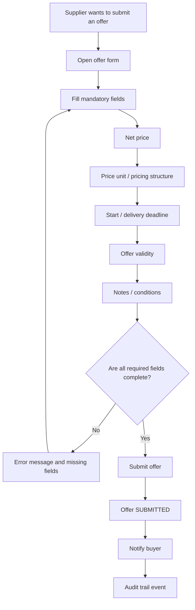

### MVP Offer Data

- supplier identifier or invited supplier details;
- RFQ identifier;
- net price;
- currency;
- price unit;
- start date / delivery deadline;
- offer validity;
- additional notes;
- status: submitted / accepted / rejected.

### Later Expansion

- line-item offers;
- attachments;
- alternative offers;
- multi-round bidding;
- BAFO;
- contractual conditions;
- PDF offer export/import.

---

## 12. Offer Comparison and Decision Workflow

The main buyer-side value is that offers do not need to be compared in emails and Excel.

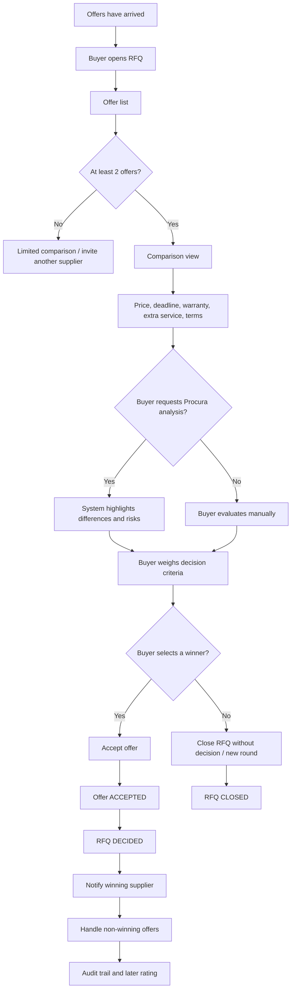

### Important Decision Principle

The system must not make the final business decision by saying “choose this one”. Procura analysis only supports the buyer:

- summarizes;
- shows differences;
- flags risks;
- highlights missing information;
- but the decision belongs to the buyer.

---

## 13. RFQ Lifecycle Status Diagram

RFQ statuses should be simple. Technical statuses may remain in English, but the Hungarian UI needs understandable business labels.

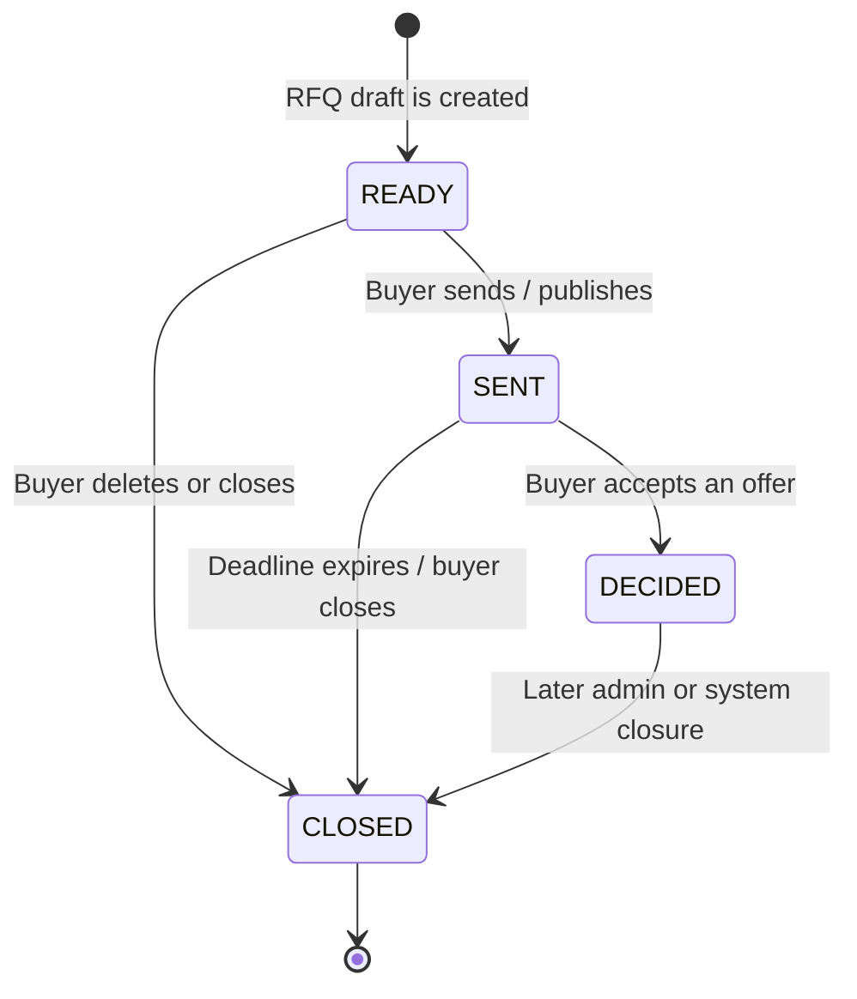

### Business Meaning of Statuses

| Technical status | Hungarian UI meaning | Business meaning |
|---|---|---|
| READY | Piszkozat / előkészítve | The RFQ has been prepared but not sent yet. |
| SENT | Kiküldve / aktív | Suppliers can already see it or have received it. |
| DECIDED | Döntés született | There is an accepted offer. |
| CLOSED | Lezárva | The process has ended, with or without a decision. |

### Open Product Decision

Later, it may be useful to introduce separate `DRAFT`, `READY`, `PUBLISHED`, `EXPIRED`, `CANCELLED` statuses, but for the MVP the simple status model is better if the current system is built around it.

---

## 14. Invitation and Offer Status Workflows

### 14.1 Invitation Status Workflow

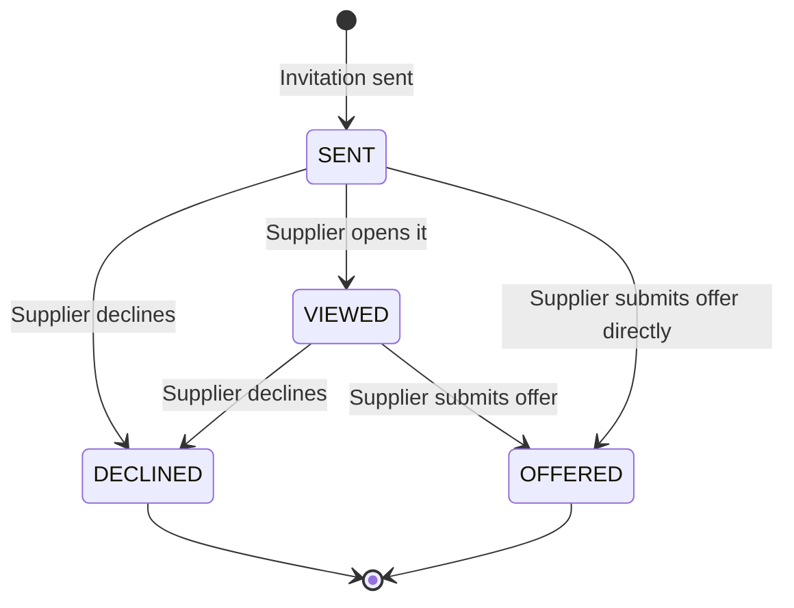

### 14.2 Offer Status Workflow

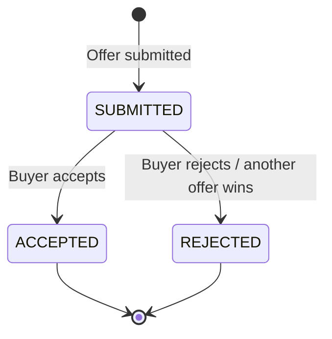

### Business Rules

- Normally, there should be one accepted offer within one RFQ.
- Handling non-winning offers should be polite and clear.
- It should not be misleading for the supplier if no decision has been made yet.
- Later versions may add statuses such as “shortlisted”, “under review”, “withdrawn” or “expired”.

---

## 15. Supply Gap and Admin Intervention Workflow

At marketplace launch, supply gaps are natural. The system should treat them not as errors, but as admin-actionable signals.

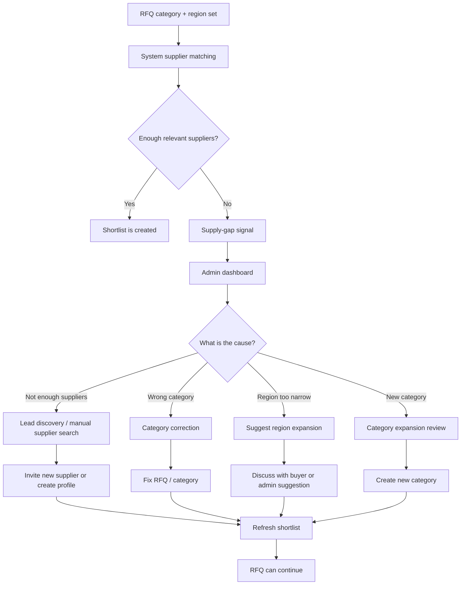

### Admin Goal

Admin does not only fix errors, but builds marketplace liquidity. Supply-gap signals can later turn into important growth and sales tasks.

### Metrics

- number of supply-gap signals by category;
- number of supply-gap signals by region;
- share of RFQs with too few suppliers;
- share of RFQs requiring admin intervention;
- number of new supplier leads;
- share of RFQs successfully completed after supply-gap handling.

---

## 16. Admin Moderation and Quality Assurance Workflow

Procura is a trust-based platform. The goal of admin moderation is not to slow the process down, but to reduce spam, bad data and abuse.

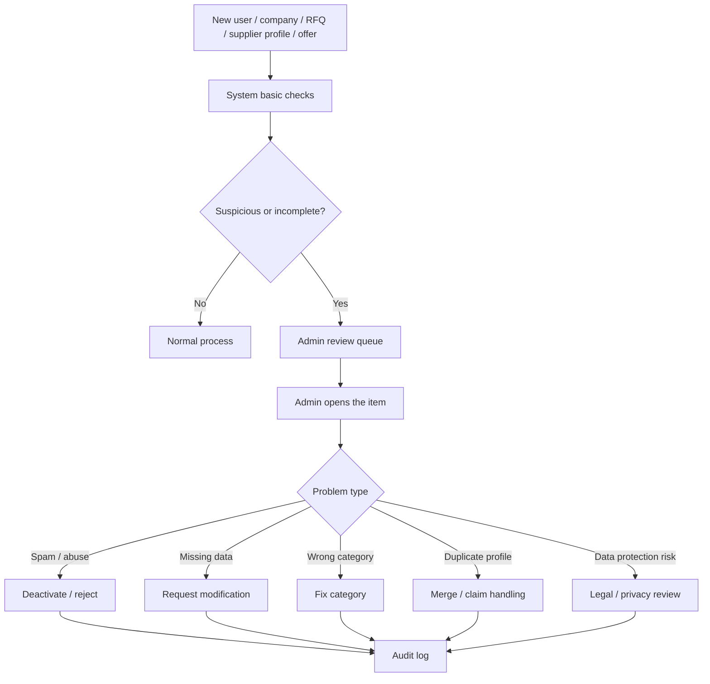

### Key Admin Review Cases

- fake or spam supplier profile;
- unrealistic RFQ;
- offensive or unlawful content;
- incorrect company data;
- duplicate supplier profile;
- too many failed invitations;
- suspicious payment / credit activity;
- RFQ or offer containing sensitive data.

---

## 17. Payment, Credit and Plan Limit Workflow

In the MVP, monetization does not necessarily mean full live payment infrastructure, but the credit/subscription logic is an important validation tool.

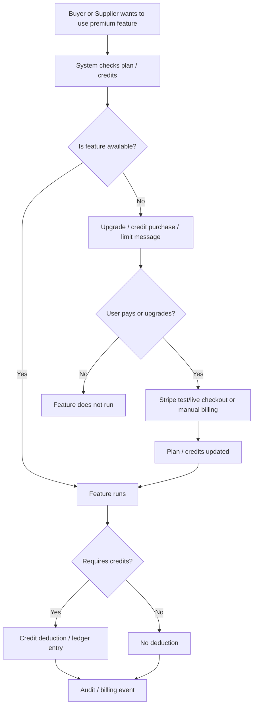

### Pre-Launch Minimum

- plan and credit rules should be clear;
- credit ledger should be searchable;
- user-facing limit messages should be understandable;
- before live payment, legal and invoicing decisions are needed;
- manual billing pilot is acceptable during validation.

---

## 18. Notification Workflow

Notifications are not optional convenience features; they are required for the marketplace to work. If the supplier does not see the invitation, or the buyer does not notice the offer, the loop breaks.

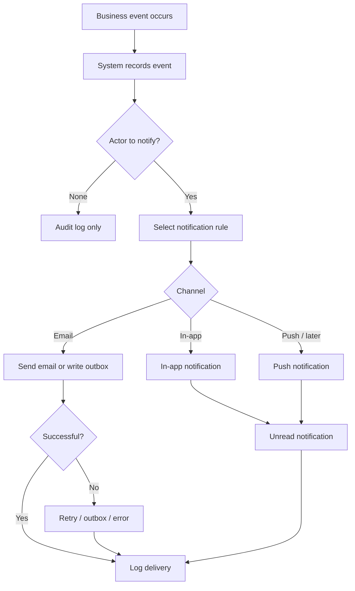

### Critical Notification Events

- RFQ invitation to supplier;
- supplier opened the invitation;
- supplier submitted a question;
- buyer answered;
- new offer arrived;
- buyer accepted the offer;
- RFQ deadline is approaching;
- credit or plan limit reached;
- admin intervention is needed.

---

## 19. Audit Trail Cross-Cutting Workflow

The audit trail cuts across every important business process. It is not an afterthought, but the basis of trust, searchability and later compliance.

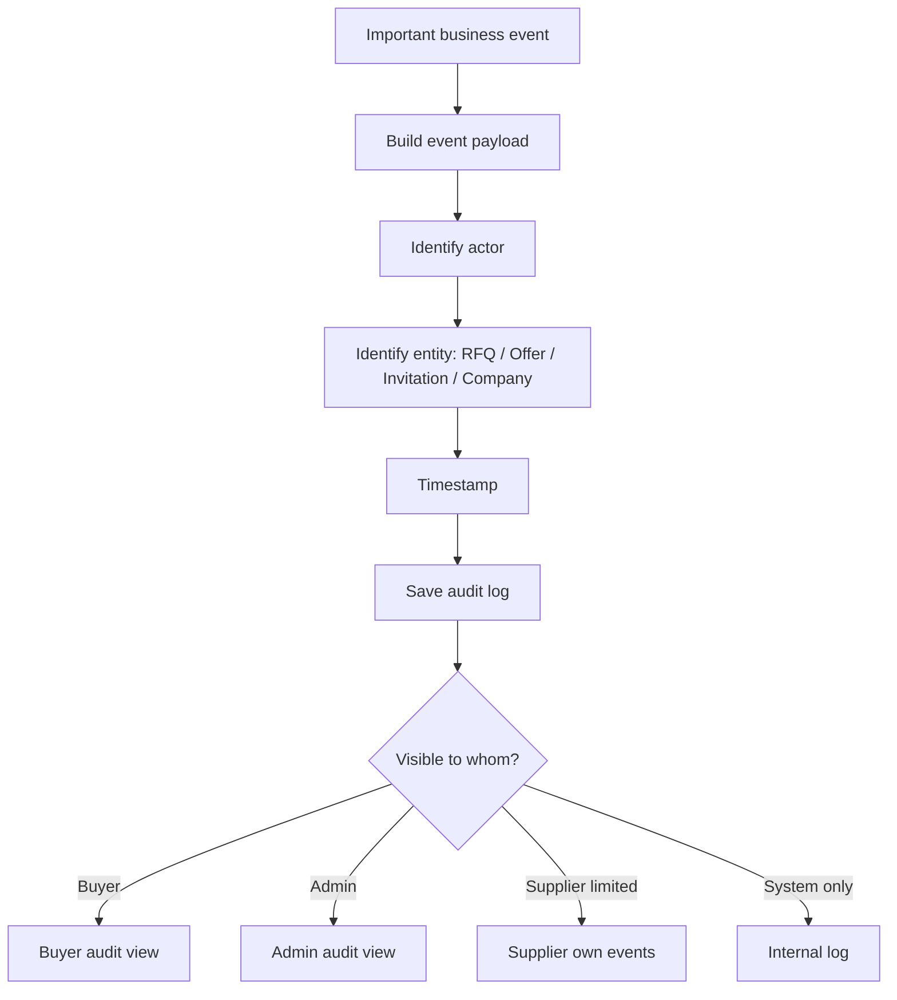

### Events to Log

- RFQ creation;
- RFQ modification;
- category/region modification;
- RFQ sending;
- supplier invitation;
- invitation opened;
- supplier question;
- buyer answer;
- offer submission;
- offer acceptance;
- RFQ closure;
- supplier rating;
- admin intervention;
- credit / subscription event.

### Important Data Protection Principle

The audit log should not contain unnecessarily sensitive data. The business event should be searchable, but the log should not duplicate every field without reason.

---

## 20. Concierge Pilot / Manual Validation Workflow

In addition to MVP software features, it may be useful to run the first RFQs in concierge mode. This helps validate the market even if some automations are not yet perfect.

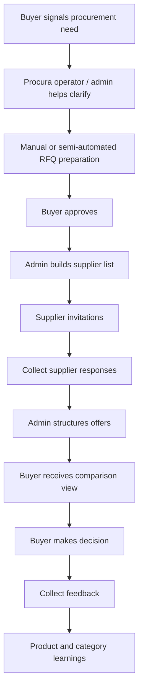

### When Is It Useful?

- when validating new categories;
- when there are too few suppliers in the system;
- when testing first willingness to pay;
- when discovering UX or automation gaps;
- with a higher-value pilot customer.

### Risk

The concierge pilot should not become a fully manual agency service. The goal is to generate learning for software-based automation.

---

## 21. Main Buyer-Side Screen Flow

This is not a final UX wireframe, but a logical screen path.

```mermaid
flowchart TD
    A[Landing / Dashboard] --> B[New RFQ]
    B --> C[Intake page]
    C --> D[Clarification questions]
    D --> E[RFQ draft editor]
    E --> F[Category and region review]
    F --> G[Supplier shortlist]
    G --> H[Invitation and publishing]
    H --> I[RFQ details / status]
    I --> J[Q&A]
    I --> K[Offers]
    K --> L[Comparison]
    L --> M[Decision]
    M --> N[Closure / rating]
    N --> O[Previous RFQs / history]
```

### Buyer UX Priorities

- clear first CTA;
- few, targeted questions;
- editable RFQ;
- explainable shortlist;
- clearly visible status;
- offers in one place;
- understandable comparison;
- searchable history.

---

## 22. Main Supplier-Side Screen Flow

```mermaid
flowchart TD
    A[Supplier invitation or supplier dashboard] --> B{Entry path}
    B -- Token link --> C[RFQ invitation page]
    B -- Registered supplier --> D[Supplier dashboard]
    D --> E[Open opportunities]
    D --> F[Invited RFQs]
    C --> G[RFQ details]
    E --> G
    F --> G
    G --> H[Q&A]
    G --> I[Offer submission]
    I --> J[Offer status]
    J --> K{Registered supplier?}
    K -- No --> L[Profile claim / registration suggestion]
    K -- Yes --> M[Supplier statistics]
```

### Supplier UX Priorities

- quick understanding of what the RFQ is about;
- clearly visible deadline;
- few required fields for the first offer;
- simple question submission;
- simple offer submission;
- motivation for later registration;
- statistics and reputation as later incentives.

---

## 23. Main Admin-Side Screen Flow

```mermaid
flowchart TD
    A[Admin dashboard] --> B[RFQ list]
    A --> C[User / company list]
    A --> D[Supplier profiles]
    A --> E[Categories and regions]
    A --> F[Supply-gap dashboard]
    A --> G[Audit log]
    A --> H[Credit / subscription data]
    B --> I[Handle problematic RFQ]
    C --> J[User deactivation / support]
    D --> K[Supplier verification / duplication]
    E --> L[Category expansion]
    F --> M[Supplier lead discovery task]
    G --> N[Event lookup]
    H --> O[Payment support]
```

### Admin UX Priorities

- visibility into where the marketplace gets stuck;
- quickly filterable RFQs;
- supply-gap focus;
- user/company search;
- moderation actions;
- audit trail;
- basic funnel metrics.

---

## 24. Mandatory Workflows for MVP Launch

Based on the previous documents and the current repository state, the following workflows must work end-to-end for MVP launch.

### P0 — Core Launch Workflows

1. Buyer registers / logs in.
2. Buyer uses a company profile.
3. Buyer starts an RFQ from a short text.
4. System suggests category and region or provides fallback.
5. System / category provides clarification questions.
6. Buyer receives and edits a structured RFQ.
7. System creates a supplier shortlist.
8. Buyer can also add own supplier email.
9. Buyer sends the RFQ.
10. Supplier opens it through a token link.
11. Supplier can ask a question.
12. Buyer can answer.
13. Supplier submits an offer.
14. Buyer sees and compares offers.
15. Buyer accepts an offer or closes the RFQ.
16. System writes audit trail.
17. Admin sees the critical workflows.

### P1 — Strong Validation Workflows

1. Open opportunities.
2. Supplier self-apply.
3. Supplier profile claim.
4. Supplier rating.
5. Procura analysis / comparison support.
6. Credit / package limit workflow.
7. Supply-gap dashboard.
8. Notification center / better notification handling.
9. GDPR export/delete.
10. Public API / integration foundation.

### P2 — Later Workflows

1. Multi-user buyer organization.
2. Approval workflow.
3. Multi-round tender / BAFO.
4. Contract generation.
5. Full payment settlement / escrow.
6. Invoicing integration.
7. Deeper supplier verification workflow.
8. Detailed supplier analytics.
9. Mobile-first workflow.
10. International multilingual rollout.

---

## 25. Out-of-Scope Workflows for the First Launch Version

The first launch version intentionally does not aim to include:

- full ERP workflow;
- public procurement legal workflow;
- automatic contract signing;
- full payment settlement;
- escrow;
- complex approval matrix;
- multiple countries and multiple languages;
- full supplier compliance audit;
- full invoicing and accounting workflow;
- enterprise SSO / enterprise IAM;
- native mobile-app-centered first go-to-market if the web-based B2B workflow has not yet been validated.

If a partial feature already exists in the repository for any of these, it does not need to be removed, but these workflows do not define the success of the first paid validation.

---

## 26. Summary

Based on Procura’s flowcharts, the product’s central logic is built around one repeatable business loop:

> buyer need → structured RFQ → supplier involvement → offers → comparison → decision → audit trail.

The most important planning conclusions:

1. **The buyer’s first experience should be fast and simple.**  
   A short need should become a sendable RFQ within a few minutes.

2. **The supplier entry barrier should be low.**  
   Token-based response and later profile claim are critical cold-start tools.

3. **Q&A should be a tool for better offer quality.**  
   It should be treated not as a chat system, but as a shared clarification mechanism.

4. **Offer comparison should be the main buyer-side value.**  
   This differentiates Procura from simple lead generation or directory models.

5. **Admin workflows are not secondary.**  
   The early marketplace is not self-running, so supply-gap handling, moderation and category management are needed.

6. **The audit trail cuts across every workflow.**  
   It provides searchability, trust and the foundation for later compliance.

7. **The first launch does not need to cover every workflow.**  
   The goal is for the core RFQ loop to work with real SME buyers and suppliers, provide measurable value and show willingness to pay.

If these workflows operate reliably, Procura will not merely be an RFQ form, but a lightweight, intelligent procurement workspace for Hungarian SMEs.
