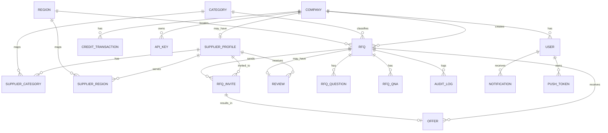
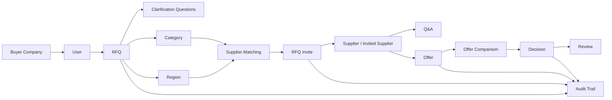
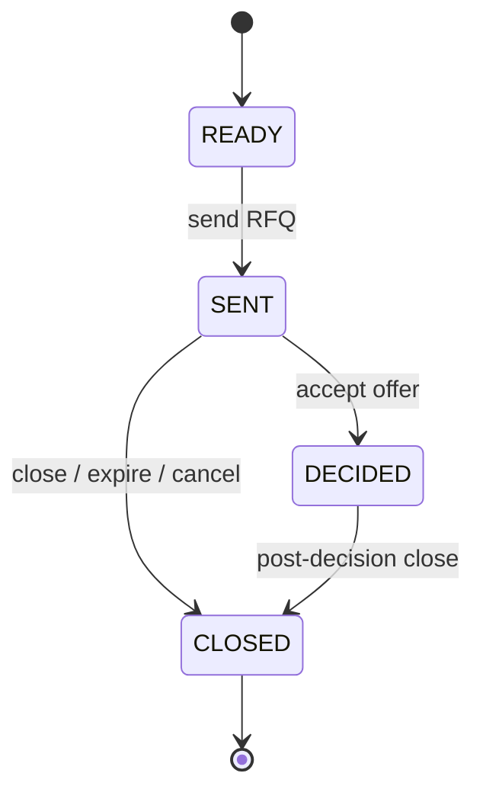
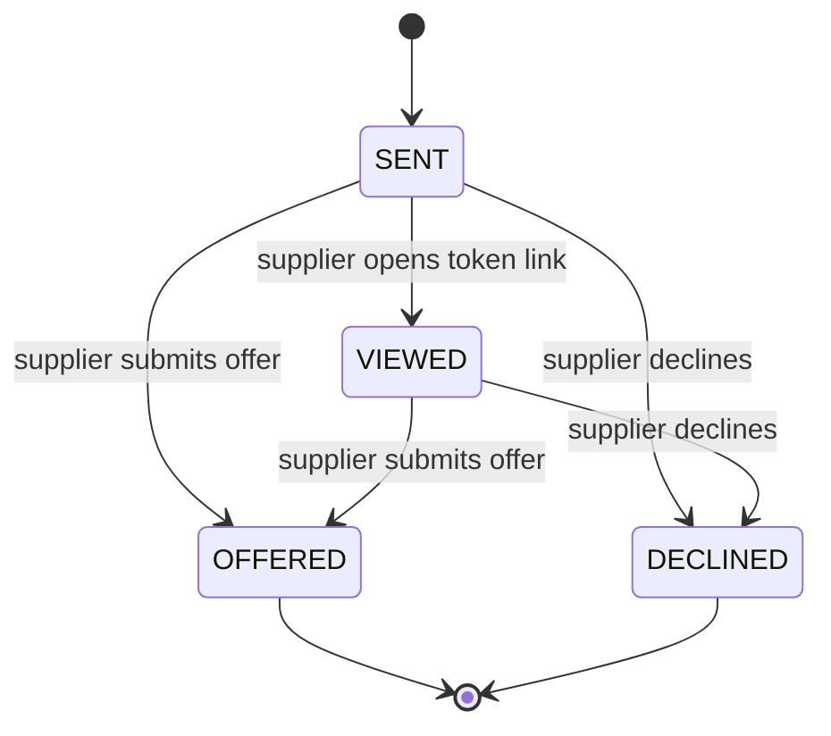
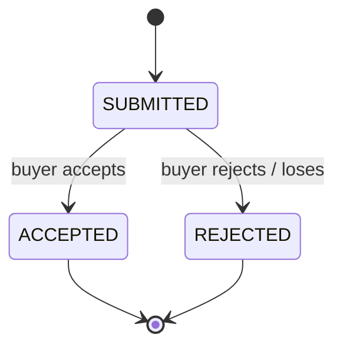

# Procura — Data Model / Domain Model

**Document status:** first developed English version  
**Language:** English  
**Related materials:** Procura one-pager; Target Group and Problem Validation Document; User Roles and Use Case Document; MVP Scope Document; Flowcharts; GitHub repository `prisma/schema.prisma`; `IMPLEMENTATION_PLAN.md`; lead-discovery schema  
**Project:** Procura — AI-assisted B2B RFQ and supplier network  
**First market:** Hungary  
**Initial focus:** General, non-strategic procurement needs of Hungarian SMEs with 10–100 employees  
**Recommended use:** functional specification, backend planning, database migration, API design, development tickets, testing, documentation, later Postgres migration

---

## 1. Purpose of This Document

This document describes Procura’s domain and data model based on the Prisma schema already present in the repository, the implementation plan, and the product planning documents created so far.

The goal is not to invent a completely new data model. The goal is to:

- interpret the existing data model from a business/domain perspective;
- clarify the main domain entities and relationships;
- preserve the models that are already implemented;
- identify missing or future extension points;
- align the technical data model with the business domain language;
- support later functional specifications, APIs and development backlog items.

This is not a final database migration plan. It is a **domain-level data model document**. Concrete Prisma migrations, indexes, field types and normalization decisions should be finalized during later technical design.

---

## 2. Starting Point and Core Principle

Procura’s current data model already covers most of the core RFQ loop:

> buyer company → user → RFQ → clarification questions → supplier shortlist / invite → supplier response → offer → comparison / analysis → decision → review → audit trail.

The main domain principle is:

> Procura is not a simple supplier directory and not an ERP system. It is a B2B procurement workspace built around a structured RFQ workflow.

Therefore, the central entity of the data model is not the supplier or the buyer in isolation, but the **RFQ**, meaning the quotation-request process.

All other main domain objects connect to this:

- the buyer company creates the RFQ;
- category and region support matching;
- the supplier profile participates in the shortlist;
- the invite connects the RFQ to a concrete supplier invitation;
- the offer is the structured supplier response submitted through the invite;
- Q&A supports clarification after the RFQ is sent;
- review and supplier statistics build reputation;
- audit log preserves the business decision trail;
- credit and subscription models support monetization.

---

## 3. Domain Layer Overview

Procura’s data model can be divided into the following major domain layers.

### 3.1 Identity and Account Layer

Objects that manage login, authorization and company ownership:

- `User`
- `Company`
- `ApiKey`
- later: `CompanyMembership`, `Role`, `Permission`, `Team`, `ApprovalRule`

### 3.2 Buyer Procurement Layer

Objects related to the buyer-side RFQ process:

- `Rfq`
- `RfqQuestion`
- `RfqQna`
- `RfqInvite`
- `Offer`
- `Review`
- `AuditLog`

### 3.3 Supplier Marketplace Layer

Objects supporting the supplier side and matching:

- `SupplierProfile`
- `SupplierCategory`
- `SupplierRegion`
- `Category`
- `Region`
- `Review`
- supplier statistics fields

### 3.4 Notification and Engagement Layer

Objects supporting user notifications:

- `Notification`
- `PushToken`
- `EmailOutbox`
- later: `NotificationPreference`, `EmailDigest`, `WebhookSubscription`

### 3.5 Monetization Layer

Objects and fields related to paid usage, credits and subscriptions:

- `Company.plan`
- `Company.creditBalance`
- Stripe-related fields on `Company`
- `CreditTransaction`
- later: `Subscription`, `Package`, `Invoice`, `Payment`, `LeadFee`, `SupplierBoost`

### 3.6 Admin, Trust and Compliance Layer

Objects supporting platform quality, safety and legal compliance:

- `AuditLog`
- `Review`
- `EmailOutbox`
- on the lead-discovery side: `Lead`, `Suppression`, `AuditEvent`
- later: `SupplierVerification`, `Certificate`, `Dispute`, `DataExportRequest`, `DeletionRequest`

---

## 4. Current Main Entities — Summary

| Entity | Business meaning | Current role |
|---|---|---|
| `User` | A human user | Login user with buyer, supplier or admin role |
| `Company` | A company or organization | Buyer or supplier company, including plan and credit data |
| `SupplierProfile` | Supplier operating profile | Categories, regions, contact, reputation and response statistics |
| `Category` | Procurement category | Basis of RFQ and supplier matching |
| `Region` | Geographic region | Basis of region-based matching |
| `Rfq` | Request-for-quotation process | Central object of the core domain |
| `RfqQuestion` | Clarification question after intake | Helps produce a structured RFQ |
| `RfqQna` | Supplier Q&A thread | Shared clarification for sent RFQs |
| `RfqInvite` | Supplier invitation or self-apply participation | Connects an RFQ to a supplier or email invite |
| `Offer` | Supplier offer | Structured offer submitted through an invite |
| `Review` | Buyer rating of supplier | Reputation and later matching input |
| `AuditLog` | Business event log | Traceability of RFQ and admin events |
| `Notification` | In-app notification | Shows core loop events to users |
| `PushToken` | Mobile push token | Used for Expo push notifications |
| `EmailOutbox` | Email fallback / developer outbox | Tracks transactional email fallback |
| `CreditTransaction` | Credit movement | Auditable credit ledger |
| `ApiKey` | Public API access key | Supports integrations and mobile/API usage |

---

## 5. High-Level Domain Diagram



---

## 6. Core Procurement Domain Diagram



---

## 7. Detailed Domain Description of Entities

## 7.1 `User`

### Business Meaning

`User` represents a human user who can sign in to the system. In the current model, the role is handled by the `role` field.

### Current Main Fields

| Field | Meaning |
|---|---|
| `id` | Unique user identifier |
| `email` | Unique login email address |
| `passwordHash` | Hashed password |
| `name` | User display name |
| `role` | `BUYER`, `SUPPLIER` or `ADMIN` |
| `active` | Soft-deactivation flag |
| `companyId` | Optional company relation |
| `createdAt` | Creation timestamp |

### Relationships

- A user may belong to one `Company`.
- A user may receive multiple `Notification` records.
- A user may have multiple `PushToken` records for mobile push.

### Domain Note

The current `role` field is simple and practical for the MVP. It supports the current three-role structure: buyer, supplier and admin.

The limitation is that it cannot fully model multi-user company permissions. Later, a user may need multiple roles in multiple companies, for example as a buyer admin in one company and supplier user in another.

### Suggested Future Extension

Introduce:

- `CompanyMembership`
- `Role`
- `Permission`

This would support:

- multiple users per company;
- company-level admins;
- approval workflows;
- supplier teams;
- different permissions for finance/admin/manager users.

---

## 7.2 `Company`

### Business Meaning

`Company` represents a business entity using Procura. It may currently be a buyer or supplier company based on the `type` field.

### Current Main Fields

| Field | Meaning |
|---|---|
| `id` | Unique company identifier |
| `name` | Company name |
| `type` | `BUYER` or `SUPPLIER` |
| `plan` | `FREE` or `PRO` |
| `stripeCustomerId` | Stripe customer identifier |
| `stripeSubscriptionId` | Stripe subscription identifier |
| `stripePaymentMethodId` | Saved payment method for later auto-recharge |
| `autoRechargeEnabled` | Whether automatic credit top-up is active |
| `autoRechargeThreshold` | Balance threshold for auto-recharge |
| `autoRechargePackageId` | Selected credit package |
| `creditBalance` | Current credit balance |
| `referralCode` | Referral program code |
| `embedToken` | Token for embeddable widget |
| `referredById` | Referring company relation |
| `createdAt` | Creation timestamp |

### Relationships

- A company has users.
- A company may have one supplier profile.
- A company may create multiple RFQs.
- A company has credit ledger entries.
- A company may own API keys.
- A company may refer other companies.

### Domain Note

`Company` is one of the most important root entities. It represents the business account around which procurement history, credits, billing and supplier identity are grouped.

The current `type` field is sufficient for the first version, but in the long run one company may act both as buyer and supplier.

### Suggested Future Decision

Replace the rigid `Company.type` logic with capability flags or role relations, for example:

- `canBuy`
- `canSell`
- `buyerProfile`
- `supplierProfile`

This would allow the same company to request offers and also respond to offers in its own service categories.

---

## 7.3 `SupplierProfile`

### Business Meaning

`SupplierProfile` describes how a supplier appears and participates in the Procura marketplace.

It is not only a public company profile; it is also a matching input.

### Current Main Fields

| Field | Meaning |
|---|---|
| `id` | Unique supplier profile identifier |
| `companyId` | Linked supplier company |
| `email` | Main supplier contact email |
| `phone` | Phone number |
| `website` | Website |
| `description` | Supplier description |
| `certifications` | Comma-separated certification list |
| `nationwide` | Whether the supplier serves the whole country |
| `inviteCount` | Number of invitations received |
| `responseCount` | Number of responses submitted |
| `avgResponseHours` | Average response time |
| `ratingSum` | Sum of ratings |
| `ratingCount` | Number of ratings |

### Relationships

- Belongs to one `Company`.
- Has many `SupplierCategory` relations.
- Has many `SupplierRegion` relations.
- Can receive many `RfqInvite` records.
- Can receive many `Review` records.

### Domain Note

The supplier profile supports both discovery and trust. It is used by matching, shortlist explanation, supplier portal, reviews and later supplier monetization.

### Suggested Future Normalization

The current `certifications` field is a simple string. Later it should become a separate model:

- `Certificate`
- `SupplierCertificate`
- `VerificationStatus`

This is important if verified supplier badges, compliance categories or occupational/fire safety services become stronger categories.

---

## 7.4 `Category`

### Business Meaning

`Category` represents a procurement category such as cleaning, HVAC, security, occupational safety, fire safety or IT support.

It is one of the main axes of the marketplace.

### Current Main Fields

| Field | Meaning |
|---|---|
| `id` | Slug-like category identifier |
| `name` | Display name |
| `clarifyQuestions` | JSON string containing category-specific clarification questions |

### Relationships

- A category has many supplier mappings through `SupplierCategory`.
- A category classifies many RFQs.

### Domain Note

Category quality strongly affects the whole product. If categories are too broad, supplier matching becomes weak. If categories are too narrow, marketplace liquidity fragments.

The first version should keep a narrow beachhead taxonomy, but the model should support later expansion.

### Suggested Future Extension

Add fields or models for:

- `parentCategoryId`
- `categoryGroup`
- `active`
- `sortOrder`
- `requiredFields`
- `questionTemplateVersion`
- category expansion requests

---

## 7.5 `Region`

### Business Meaning

`Region` represents the geographic area where a procurement need or supplier service applies.

### Current Main Fields

| Field | Meaning |
|---|---|
| `id` | Region slug |
| `name` | Region display name |

### Relationships

- A region has many supplier mappings through `SupplierRegion`.
- A region can be assigned to many RFQs.

### Domain Note

Region matching is essential in local and facility-related services. In the MVP, county-level or broad region-level matching may be enough. Later, finer granularity may be needed, especially for Budapest and dense urban areas.

### Suggested Future Extension

- county → city → district hierarchy;
- service radius;
- GPS / geocoding;
- nationwide supplier weighting;
- multi-region RFQs.

---

## 7.6 `SupplierCategory` and `SupplierRegion`

### Business Meaning

These are join tables connecting suppliers to the categories and regions they serve.

### Domain Role

They are the basis of deterministic supplier matching.

### Relationships

- `SupplierCategory`: supplier ↔ category many-to-many.
- `SupplierRegion`: supplier ↔ region many-to-many.

### Suggested Future Extension

Later, these relations may need additional attributes:

- priority;
- capacity;
- paused state;
- price floor;
- lead time;
- service radius;
- premium/boost status;
- verification level by category.

At that point, the join table should become a richer domain object.

---

## 7.7 `Rfq`

### Business Meaning

`Rfq` is the central entity of Procura. It represents one complete request-for-quotation process.

### Current Main Fields

| Field | Meaning |
|---|---|
| `id` | Unique RFQ identifier |
| `companyId` | Buyer company |
| `createdById` | User who created the RFQ |
| `intakeText` | Original short buyer need |
| `title` | RFQ title |
| `categoryId` | Procurement category |
| `regionId` | Region |
| `status` | `READY`, `SENT`, `DECIDED`, `CLOSED` |
| `isPublic` | Whether it appears on the public/open tender board |
| `deadline` | Offer deadline |
| `spec` | JSON string containing structured specification |
| `aiComparison` | Stored Procura analysis / comparison output |
| `createdAt` | Creation timestamp |

### Relationships

- Belongs to one buyer `Company`.
- May belong to one `Category` and one `Region`.
- Has clarification questions.
- Has supplier Q&A threads.
- Has invites.
- Has offers.
- Has audit logs.
- May have one review after decision.

### Domain Note

`Rfq` should be treated as an aggregate root in the procurement workflow. Many important business rules should be enforced around it:

- when it can be sent;
- when it can be edited;
- who can view it;
- when offers can be accepted;
- when the process is closed;
- what gets written to audit log.

### Suggested Future Status Refinement

The current statuses are enough for the MVP, but later a more detailed state machine may be useful:

- `DRAFT`
- `READY`
- `SENT`
- `QUESTION_PERIOD`
- `OFFERING`
- `EVALUATION`
- `DECIDED`
- `CLOSED_NO_DECISION`
- `EXPIRED`
- `CANCELLED`

For the user interface, these should be shown in Hungarian business language, even if code-level values remain English.

---

## 7.8 `RfqQuestion`

### Business Meaning

`RfqQuestion` stores clarification questions generated or selected after the buyer’s initial intake text.

### Current Main Fields

| Field | Meaning |
|---|---|
| `id` | Unique question identifier |
| `rfqId` | Parent RFQ |
| `order` | Display order |
| `question` | Question text |
| `answer` | Buyer answer |

### Domain Role

This model captures the guided intake process. It explains how the short, informal need becomes a better RFQ specification.

### Suggested Future Extension

- question type: text, number, select, multi-select, date;
- required flag;
- category template version;
- answer validation;
- visibility in final supplier-facing RFQ.

---

## 7.9 `RfqQna`

### Business Meaning

`RfqQna` represents supplier-side clarification after an RFQ has already been sent.

A supplier asks a question, the buyer answers, and the answer is visible to relevant participants.

### Current Main Fields

| Field | Meaning |
|---|---|
| `id` | Unique Q&A identifier |
| `rfqId` | Parent RFQ |
| `supplierId` | Registered supplier asking the question, if any |
| `askedBy` | Display label of asker |
| `question` | Question text |
| `answer` | Buyer answer |
| `createdAt` | Question timestamp |
| `answeredAt` | Answer timestamp |

### Domain Role

This model supports fairness and comparability: all participating suppliers can work from the same clarification information.

### Suggested Future Extension

- visibility scope;
- moderation status;
- private question mode if needed;
- link frequent questions back into category templates;
- attachment support for clarification.

---

## 7.10 `RfqInvite`

### Business Meaning

`RfqInvite` represents the participation of a supplier in one RFQ.

It can be:

- a matched supplier invite;
- an extra email invite added by the buyer;
- a self-apply participation from an open opportunity.

### Current Main Fields

| Field | Meaning |
|---|---|
| `id` | Unique invite identifier |
| `rfqId` | Parent RFQ |
| `supplierId` | Linked registered supplier, optional |
| `email` | Invite email address |
| `companyName` | Supplier company display name |
| `token` | Unique token for supplier response link |
| `status` | `SENT`, `VIEWED`, `DECLINED`, `OFFERED` |
| `source` | `MATCHED` or `SELF` |
| `matchScore` | Matching score |
| `matchReason` | Human-readable matching explanation |
| `sentAt` | Sent timestamp |
| `viewedAt` | Viewed timestamp |
| `respondedAt` | Response timestamp |

### Relationships

- Belongs to one `Rfq`.
- May belong to one `SupplierProfile`.
- May result in one `Offer`.

### Domain Note

This entity is critical for supporting no-registration supplier response. It is also the link between matching and actual marketplace activity.

### Suggested Future Extension

- invite expiration;
- decline reason;
- reminder count;
- bounce status;
- source detail: buyer-added, system-matched, open-board, referral, lead-discovery;
- security metadata for token usage.

---

## 7.11 `Offer`

### Business Meaning

`Offer` represents a structured supplier offer submitted for an RFQ through an invite.

### Current Main Fields

| Field | Meaning |
|---|---|
| `id` | Unique offer identifier |
| `rfqId` | Parent RFQ |
| `inviteId` | Source invite |
| `companyName` | Supplier company name |
| `contactEmail` | Supplier contact email |
| `priceNet` | Net price |
| `priceUnit` | Pricing unit |
| `startDate` | Start date or availability |
| `validUntil` | Offer validity |
| `notes` | Additional notes |
| `status` | `SUBMITTED`, `ACCEPTED`, `REJECTED` |
| `createdAt` | Submission timestamp |

### Domain Role

The offer is the core comparable supplier response. It is the main input for comparison, analysis, decision and review.

### Important Current Limitation

The current model supports simple one-line offers. This is suitable for MVP validation, but later many categories will need line items or more structured pricing.

### Suggested Future Extension

Introduce:

- `OfferLineItem`
- `OfferAttachment`
- `OfferRevision`
- `OfferClarification`
- `OfferCurrency`
- `TaxRate`
- `PaymentTerms`
- `WarrantyTerms`

This becomes important when Procura handles more complex service packages or equipment procurement.

---

## 7.12 `Review`

### Business Meaning

`Review` is the buyer’s rating of the winning supplier after an RFQ decision.

### Current Main Fields

| Field | Meaning |
|---|---|
| `id` | Unique review identifier |
| `rfqId` | Related RFQ, unique |
| `supplierId` | Rated supplier |
| `reviewerCompanyId` | Buyer company submitting the review |
| `rating` | 1–5 rating |
| `comment` | Optional text comment |
| `createdAt` | Creation timestamp |

### Domain Role

Review supports:

- supplier reputation;
- matching score improvement;
- buyer trust;
- supplier performance feedback.

### Important Product Decision

Reviews should not become uncontrolled public criticism in the first version. It may be better to use them first as internal trust/matching signals and expose them gradually.

---

## 7.13 `AuditLog`

### Business Meaning

`AuditLog` records important business events. It creates the procurement decision trail.

### Current Main Fields

| Field | Meaning |
|---|---|
| `id` | Unique log identifier |
| `rfqId` | Related RFQ, optional |
| `actor` | Actor label |
| `event` | Event name |
| `meta` | JSON-like metadata string |
| `createdAt` | Timestamp |

### Domain Role

Audit logging is one of the differentiators between Procura and simple email-based procurement.

It should record:

- RFQ creation;
- RFQ modification;
- send-out;
- invite creation;
- invite viewed;
- question submitted;
- answer submitted;
- offer submitted;
- offer accepted;
- RFQ closed;
- supplier reviewed;
- admin intervention;
- credit movement if relevant.

### Launch-Critical Note

Audit completeness is a launch-critical requirement: every important business mutation should create an `AuditLog` row.

### Suggested Event Taxonomy

Recommended event names:

- `RFQ_CREATED`
- `RFQ_UPDATED`
- `RFQ_SENT`
- `RFQ_CLOSED`
- `INVITE_SENT`
- `INVITE_VIEWED`
- `INVITE_DECLINED`
- `QNA_QUESTION_CREATED`
- `QNA_ANSWERED`
- `OFFER_SUBMITTED`
- `OFFER_ACCEPTED`
- `OFFER_REJECTED`
- `REVIEW_CREATED`
- `ADMIN_UPDATED_RFQ`
- `CREDIT_CHARGED`
- `CREDIT_GRANTED`

---

## 7.14 `Notification` and `PushToken`

### Business Meaning

These models support in-app and mobile push notifications.

### `Notification` Main Fields

| Field | Meaning |
|---|---|
| `id` | Unique notification identifier |
| `userId` | Recipient user |
| `type` | Notification type |
| `message` | Display text |
| `linkUrl` | Optional link |
| `read` | Read/unread state |
| `createdAt` | Creation timestamp |

### `PushToken` Main Fields

| Field | Meaning |
|---|---|
| `id` | Unique token identifier |
| `userId` | Owner user |
| `token` | Expo push token |
| `platform` | iOS / Android |
| `createdAt` | Creation timestamp |

### Suggested Future Extension

- `NotificationPreference`
- quiet hours;
- notification digest;
- channel opt-in/out;
- SMS for urgent events;
- webhook notifications.

---

## 7.15 `EmailOutbox`

### Business Meaning

`EmailOutbox` is a fallback and tracking model for transactional emails.

### Current Main Fields

| Field | Meaning |
|---|---|
| `id` | Unique outbox record |
| `to` | Recipient email |
| `subject` | Subject |
| `body` | Email body |
| `rfqId` | Related RFQ, optional |
| `createdAt` | Creation timestamp |

### Domain Role

Email is critical because invited suppliers may not be registered. The outbox helps preserve the flow in development or fallback mode.

### Suggested Future Extension

- provider message id;
- delivery status;
- opened/clicked status;
- bounce handling;
- retry count;
- template name;
- unsubscribe handling for non-transactional messages.

---

## 7.16 `CreditTransaction`

### Business Meaning

`CreditTransaction` records every credit balance change for a company.

### Current Main Fields

| Field | Meaning |
|---|---|
| `id` | Unique transaction identifier |
| `companyId` | Related company |
| `amount` | Positive top-up or negative usage |
| `balanceAfter` | Balance after transaction |
| `type` | `BONUS`, `PURCHASE`, `USAGE` |
| `description` | Human-readable description |
| `reference` | External reference for idempotency |
| `createdAt` | Timestamp |

### Domain Role

The credit ledger is the foundation of credit-based monetization and analysis-feature billing.

### Important Invariant

Every credit balance mutation must go through a ledgered transaction. The current `balanceAfter` design is useful because it makes historical reconstruction easier.

---

## 7.17 `ApiKey`

### Business Meaning

`ApiKey` represents a company-level API access credential.

### Current Main Fields

| Field | Meaning |
|---|---|
| `id` | Unique key identifier |
| `companyId` | Owning company |
| `name` | Key label |
| `keyHash` | Hashed API key |
| `createdAt` | Creation timestamp |
| `lastUsedAt` | Last usage timestamp |

### Domain Role

This supports public API access, integrations and mobile/API use cases. Only the hash is stored, which is the correct security pattern.

### Suggested Future Extension

- scopes;
- expiration;
- rate limits per key;
- allowed origins / IPs;
- webhook subscriptions;
- audit log of API usage.

---

## 8. Lead-Discovery Related Domain Model

The lead-discovery project is not part of the core Procura web application, but it is domain-relevant because it supports supplier-side liquidity and profile claiming.

## 8.1 `Lead`

### Business Meaning

`Lead` represents a discovered business that may become a supplier.

### Main Fields

| Field | Meaning |
|---|---|
| `dedupeKey` | Stable identity key, based on VAT/domain/name+region |
| `legalName` | Legal company name |
| `brandName` | Brand or trading name |
| `vatNumber` | VAT number |
| `registrationNumber` | Company registration number |
| `email` | Contact email |
| `phone` | Phone |
| `website` | Website |
| `domain` | Domain |
| `address` | Address |
| `regionId` | Procura region id |
| `categories` | JSON list of Procura category ids |
| `source` | Source connector id |
| `sourceUrl` | Source URL |
| `sourceLicense` | Source license |
| `isPersonalData` | Whether the lead contains personal data |
| `gdprBasis` | GDPR legal basis |
| `qualityScore` | Lead quality score |
| `lifecycle` | `NEW`, `CONTACTED`, `RESPONDED`, `REGISTERED`, `SUPPRESSED` |

### Connection to the Main Procura Domain

A lead may later become:

- a `Company` of type supplier;
- a `SupplierProfile`;
- a source for a token-based invite;
- a claimable supplier profile;
- a suppressed record if opt-out occurs.

### Important Compliance Principle

Lead discovery and outreach must remain legal-gated. No collection or outreach should launch without data-protection review, including LIA/DPIA, privacy notice and opt-out process.

---

## 8.2 `Suppression`

### Business Meaning

`Suppression` is the global do-not-contact list.

### Domain Role

It prevents outreach to emails or domains that opted out, bounced hard or should otherwise not be contacted.

This is critical for trust and legal compliance.

---

## 8.3 `AuditEvent`

### Business Meaning

`AuditEvent` records lead-discovery accountability events.

### Domain Role

It should record when a lead was collected, contacted, opted out, verified, responded or registered.

This is separate from the core Procura `AuditLog`, but conceptually similar.

---

## 9. RFQ State Model



### Business Interpretation of Statuses

| Status | Meaning |
|---|---|
| `READY` | The RFQ is prepared but has not been sent yet |
| `SENT` | The RFQ has been sent or published |
| `DECIDED` | The buyer has accepted an offer |
| `CLOSED` | The process is closed, either with or without decision |

### Recommended Pre-Launch Check

Clarify exactly:

- whether `DECIDED` and `CLOSED` are separate final states;
- what happens after deadline;
- whether sent RFQs can be edited;
- whether a closed RFQ can be reopened;
- how cancelled RFQs should be represented.

---

## 10. Invitation State Model



### Business Interpretation of Statuses

| Status | Meaning |
|---|---|
| `SENT` | Invitation has been sent |
| `VIEWED` | Supplier opened the RFQ |
| `DECLINED` | Supplier declined the opportunity |
| `OFFERED` | Supplier submitted an offer |

### Important Domain Invariant

One invite should result in at most one current offer in the MVP. If offer revision becomes supported later, offer history should become separate.

---

## 11. Offer State Model



### Business Interpretation of Statuses

| Status | Meaning |
|---|---|
| `SUBMITTED` | Offer has been submitted |
| `ACCEPTED` | Buyer selected this offer |
| `REJECTED` | Buyer rejected this offer or chose another one |

### Important Domain Invariants

- In one RFQ, normally only one offer should be `ACCEPTED`.
- Accepting an offer should change the RFQ to `DECIDED`.
- Accepting an offer should create an audit log event.
- The winning supplier should receive notification.
- Non-winning offers may become `REJECTED` automatically or through explicit buyer action.

---

## 12. Important Business Invariants

### 12.1 Company and User Rules

- Every buyer RFQ must belong to a buyer company.
- Users must not access other companies’ private RFQs.
- Inactive users cannot sign in.
- Admin users may access platform-level views based on admin permission.

### 12.2 Supplier Matching Rules

- A supplier should match an RFQ if category and region rules match.
- Nationwide suppliers may match regional RFQs.
- Matching score should be explainable.
- Reviews, response rate and certifications may influence matching.

### 12.3 RFQ Rules

- RFQ can be created from a short intake text.
- RFQ should have a category and region before sending, if possible.
- Sent RFQs should have at least one invite or be public.
- Important RFQ state changes must be logged.

### 12.4 Invite Rules

- Every invite must have a unique token.
- Token access must be limited to one RFQ.
- Invite status should reflect supplier action.
- Self-applied suppliers should still create an invite/participation record.

### 12.5 Offer Rules

- Every offer belongs to an RFQ.
- Every offer belongs to exactly one invite.
- Offer data should be structured enough for comparison.
- Offer acceptance must be auditable.

### 12.6 Credit Rules

- Every credit balance change must create a `CreditTransaction`.
- External payment references should be idempotent.
- Credit-based feature usage should fail safely if balance is insufficient.
- Credit usage should not bypass the ledger.

### 12.7 Audit Rules

- Business mutations must be logged.
- Audit log metadata should be useful but not expose unnecessary sensitive data.
- Admin interventions should also be logged.

---

## 13. Structured JSON Fields

Several current fields are stored as strings but logically contain JSON. This is acceptable for the MVP but should be treated carefully.

## 13.1 `Category.clarifyQuestions`

### Current Meaning

A JSON string containing a list of category-specific clarification questions.

### Example

```json
[
  "Milyen gyakorisággal van szükség a szolgáltatásra?",
  "Melyik telephelyen kell teljesíteni?",
  "Van-e speciális minősítési elvárás?"
]
```

### Suggested Future Shape

```json
[
  {
    "id": "frequency",
    "label": "Milyen gyakorisággal van szükség a szolgáltatásra?",
    "type": "select",
    "required": true,
    "options": ["alkalmi", "heti", "havi", "folyamatos"]
  }
]
```

---

## 13.2 `Rfq.spec`

### Current Meaning

Structured RFQ specification generated from intake and clarification answers.

### Suggested Minimal Logical Shape

```json
{
  "summary": "Office cleaning service for a 30-person company",
  "scope": "Weekly cleaning of office and common areas",
  "location": "Budapest",
  "requirements": [
    "monthly pricing",
    "own tools and materials",
    "references preferred"
  ],
  "deadline": "2026-07-15"
}
```

### Future Recommendation

Define category-specific spec schemas and validate them with Zod or a similar schema layer.

---

## 13.3 `Rfq.aiComparison`

### Current Meaning

Stored Procura analysis or comparison output.

### Important Product Principle

Even if this is AI-assisted internally, the user-facing language should not sell “AI”. The output should be positioned as:

- Procura analysis;
- comparison summary;
- risk highlights;
- decision support.

The system should not make the final decision.

---

## 13.4 `AuditLog.meta`

### Current Meaning

Free-form metadata string, often JSON-like.

### Suggested Principle

Use compact structured JSON containing only necessary business context.

### Example

```json
{
  "offerId": "off_123",
  "supplierName": "CleanPro Facility Kft.",
  "previousStatus": "SUBMITTED",
  "newStatus": "ACCEPTED"
}
```

---

## 14. Strengths of the Current Model

The current model is strong for MVP validation because:

- RFQ is correctly placed at the center;
- buyer, supplier and admin roles are represented;
- token-based supplier response is supported;
- registered and non-registered suppliers can participate;
- category and region matching are modeled;
- offers are structured enough for initial comparison;
- reviews feed reputation and matching;
- credit ledger and plan fields support monetization;
- notification and push infrastructure already have data support;
- audit logging exists;
- public API keys are modeled securely;
- lead discovery is separated into its own compliance-gated domain.

---

## 15. Main Risks / Technical Debt in the Current Model

## 15.1 Too Many String Enums

Several fields use raw strings:

- `User.role`
- `Company.type`
- `Company.plan`
- `Rfq.status`
- `RfqInvite.status`
- `RfqInvite.source`
- `Offer.status`
- `CreditTransaction.type`
- `Notification.type`

### Recommendation

Introduce TypeScript-level constants immediately and consider Prisma enums before Postgres migration.

---

## 15.2 Unstructured JSON String Fields

Fields such as `Rfq.spec`, `Rfq.aiComparison`, `AuditLog.meta` and `Category.clarifyQuestions` are flexible but under-validated.

### Recommendation

Define Zod schemas and migrate to JSON/JSONB when switching to Postgres.

---

## 15.3 Rigid Buyer and Supplier Company Roles

A company is currently either buyer or supplier.

### Recommendation

In the long term, support dual-capability companies.

---

## 15.4 Simple Offer Model

A single price and price unit is enough for simple services but limited for more complex procurement.

### Recommendation

Add line items, attachments, terms and revision history later.

---

## 15.5 Audit Completeness Is Not Yet Guaranteed

The model exists, but every business mutation must consistently create an audit row.

### Recommendation

Centralize write operations in service/lib functions and test audit side effects.

---

## 15.6 Missing Attachments

RFQ attachments are a near-term backlog item.

### Recommendation

Add an `Attachment` model connected to RFQ, offer and possibly Q&A.

---

## 16. Suggested New or Future Entities

## 16.1 `Attachment`

### Goal

Store files connected to RFQs, offers and clarification threads.

### Suggested Fields

| Field | Meaning |
|---|---|
| `id` | Unique identifier |
| `ownerType` | `RFQ`, `OFFER`, `QNA` |
| `ownerId` | Related entity id |
| `fileName` | Original file name |
| `mimeType` | File type |
| `sizeBytes` | File size |
| `storageKey` | Storage path/key |
| `uploadedById` | User who uploaded the file |
| `createdAt` | Timestamp |

### Why Important?

Many RFQs need drawings, photos, specifications, contracts or spreadsheets.

---

## 16.2 `CompanyMembership`

### Goal

Support multiple users per buyer or supplier company.

### Suggested Fields

| Field | Meaning |
|---|---|
| `companyId` | Company |
| `userId` | User |
| `role` | Company-level role |
| `active` | Active membership |
| `createdAt` | Creation timestamp |

### Why Important?

Needed for Team / Enterprise tiers, approval flows and supplier teams.

---

## 16.3 `ApprovalRule`

### Goal

Support buyer-side approval workflows.

### Example

- RFQ above HUF 500,000 requires manager approval before sending.
- Offer acceptance above HUF 1,000,000 requires owner approval.

---

## 16.4 `CategoryExpansionRequest`

### Goal

Track intake cases where the system cannot map the request to an existing category.

### Suggested Fields

| Field | Meaning |
|---|---|
| `id` | Unique identifier |
| `rfqId` | Related RFQ |
| `intakeText` | Original request |
| `suggestedName` | Suggested category name |
| `status` | `NEW`, `REVIEWED`, `CREATED`, `REJECTED` |
| `adminNotes` | Notes |
| `createdAt` | Timestamp |

---

## 16.5 `SupplierVerification`

### Goal

Support supplier trust and verified badges.

### Possible Types

- company registry check;
- VAT number validation;
- certification verification;
- manual admin verification;
- insurance / license verification.

---

## 16.6 `SavedSupplier` / `BlockedSupplier`

### Goal

Allow buyers to prefer or block suppliers.

### Why Important?

This improves matching while preserving buyer control and supports repeated procurement workflows.

---

## 16.7 `OfferLineItem`

### Goal

Support more complex offers with multiple priced components.

### Example

```text
Base monthly fee: HUF 120,000
Extra weekend service: HUF 15,000 / occasion
Initial setup fee: HUF 40,000
```

### When Needed?

When Procura moves deeper into facility management, subcontracting, equipment procurement or complex services.

---

## 16.8 `WebhookSubscription`

### Goal

Support outbound integrations.

### Events

- `offer.received`
- `rfq.sent`
- `rfq.decided`
- `supplier.invited`
- `credit.low`

---

## 17. Data Model and API Design Consequences

### 17.1 Do Not Expose Every Internal Field in the API

The public API should not return raw internal objects directly.

For example, it should not expose:

- password hash;
- internal Stripe ids;
- invite tokens unless needed;
- internal audit metadata;
- private supplier scoring details;
- unrelated company data.

### 17.2 DTOs and View Models Are Needed

Recommended API models:

- `RfqSummaryDto`
- `RfqDetailDto`
- `SupplierShortlistItemDto`
- `OfferComparisonDto`
- `AuditTimelineItemDto`
- `CompanyBillingDto`
- `PublicTenderDto`

These should be designed around user-facing needs, not database tables.

### 17.3 Hungarian UI, English Codebase

The repository rule should remain:

- code-level identifiers in English;
- UI labels in Hungarian;
- database enum values in English;
- user-facing status labels translated to Hungarian;
- generated analysis output in Hungarian.

This means API responses may return both:

```json
{
  "status": "SENT",
  "statusLabel": "Kiküldve"
}
```

---

## 18. Data Protection and Compliance Considerations

### 18.1 Personal Data

The model may contain personal data in:

- user names and emails;
- supplier contact emails;
- phone numbers;
- lead-discovery records;
- invite email addresses;
- Q&A and offer notes.

These need clear retention and deletion rules.

### 18.2 Business Secrets

RFQs and offers may contain sensitive business information:

- prices;
- supplier terms;
- internal operational needs;
- site details;
- accepted supplier decisions.

Access control must ensure that only relevant parties can view them.

### 18.3 Domain-Level Rules

- Suppliers must not see each other’s offers.
- Invited suppliers must only see the RFQ they were invited to.
- Public tenders should reveal only appropriate fields.
- Audit logs should not unnecessarily expose sensitive data.
- Lead discovery must respect suppression and opt-out rules.

---

## 19. Migration and Technical Direction

### 19.1 SQLite → Postgres

The current schema is designed to be Postgres-compatible. Before production launch, managed Postgres should become the target database.

### 19.2 JSON String → JSONB

Fields that logically contain JSON should become JSON/JSONB in Postgres:

- `Rfq.spec`
- `Rfq.aiComparison`
- `AuditLog.meta`
- `Category.clarifyQuestions`

This enables better validation, querying and indexing.

### 19.3 Indexing Recommendations

Important indexes should support:

- RFQs by company and status;
- RFQs by category and region;
- public RFQs;
- invites by token;
- invites by RFQ;
- offers by RFQ;
- notifications by user and read state;
- credit transactions by company;
- supplier categories and regions.

### 19.4 Soft Delete Strategy

Current `User.active` supports user deactivation. Later, a broader soft-delete strategy may be needed for:

- companies;
- supplier profiles;
- RFQs;
- API keys;
- leads;
- personal data deletion requests.

---

## 20. Model Priorities Before Launch

### 20.1 Must Check Before Launch

- Every business mutation writes audit log where required.
- Every credit change writes a credit transaction.
- Invite token access is properly scoped.
- Suppliers cannot see other suppliers’ offers.
- Public tender data exposure is limited.
- RFQ status transitions are consistent.
- Credit and subscription limits are enforced server-side.
- GDPR export and deletion work correctly.

### 20.2 Recommended Shortly After Launch

- `Attachment` model.
- More structured `Rfq.spec` schema.
- Stronger enum typing.
- Company membership model.
- Supplier verification model.
- Category expansion request model.
- Offer line items.
- Notification preferences.

---

## 21. Summary

Procura’s current data model is a solid MVP foundation because it organizes the product around the RFQ, which is the core business object:

> buyer need → RFQ → category/region → supplier matching → invite → offer → decision → review → audit trail.

The most important next data-model focus is not a full redesign, but targeted strengthening:

1. audit completeness;
2. credit ledger consistency;
3. Postgres-ready normalization;
4. attachment model;
5. preparation for multi-user companies;
6. supplier verification and category expansion;
7. more structured offer and JSON schema validation.

If these are handled well, the model can support both the first paid validation phase and the later evolution toward a broader procurement marketplace and supplier network.
